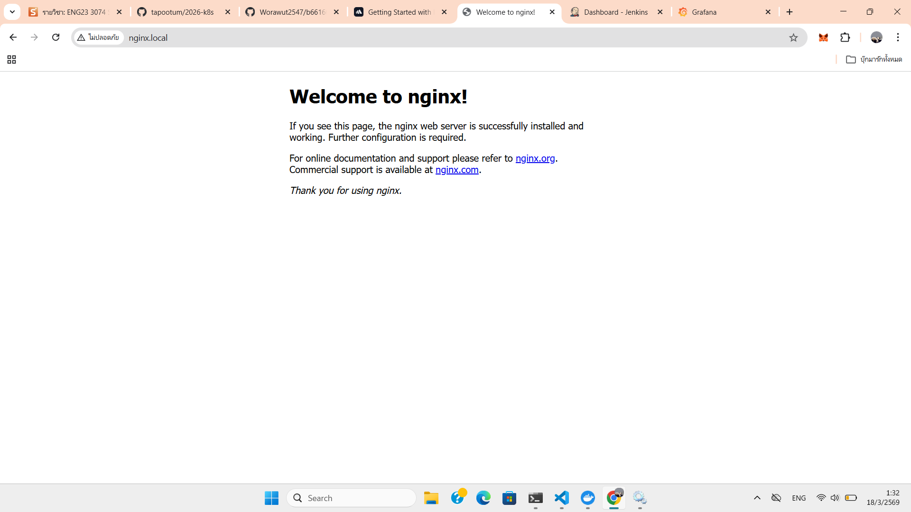
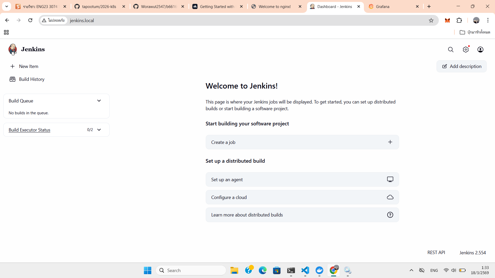
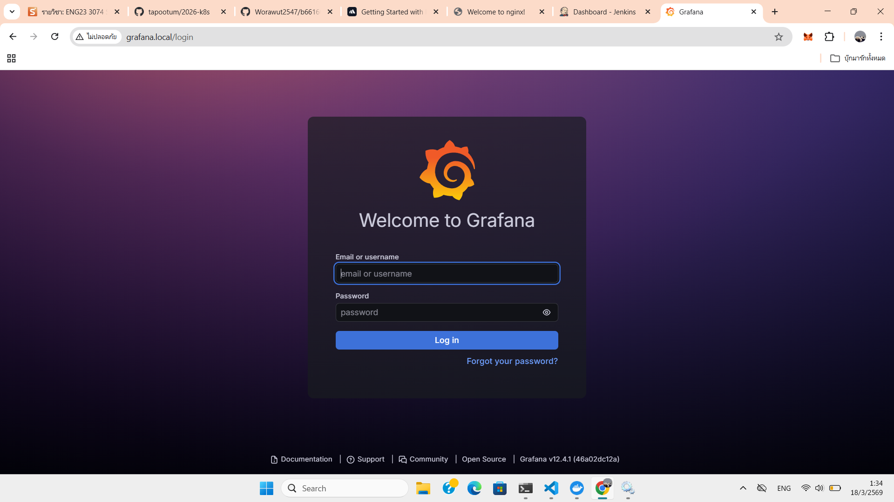

# Kubernetes Deployment Project

## ข้อมูลนักศึกษา

- **รหัสนักศึกษา:** B6616052
- **ชื่อ:** วรวุฒิ ทัศน์ทอง (Worrawut Tattong)

---

## Project Overview

โครงการนี้เป็นการติดตั้ง Kubernetes Deployment สำหรับสามบริการหลัก:
1. **Nginx** - Web Server
2. **Jenkins** - CI/CD System
3. **Grafana** - Monitoring System

---

## Architecture Overview

### Nginx

Nginx ทำหน้าที่เป็น Reverse Proxy และ Load Balancer สำหรับรับเข้าจากภายนอก

### Jenkins

Jenkins ใช้สำหรับ Continuous Integration / Continuous Delivery (CI/CD) pipelines

### Grafana

Grafana ใช้สำหรับการสรุป และแสดงข้อมูลการตรวจสอบระบบ (Monitoring)

---

## Project Structure

```
k8s/
├── kind-config.yaml            # KinD cluster configuration
├── kustomization.yaml          # Kustomize configuration
├── namespace/
│   └── namespace.yaml          # Kubernetes namespaces definition
├── nginx/
│   ├── deployment/
│   │   └── deploy.yaml        # Nginx deployment manifest
│   ├── ingress/
│   │   └── ingress.yaml       # Ingress configuration
│   └── service/
│       └── service.yaml       # Service configuration
├── jenkins/
│   ├── deployment/
│   │   └── deploy.yaml        # Jenkins deployment manifest
│   ├── ingress/
│   │   └── ingress.yaml       # Ingress configuration
│   ├── pv/
│   │   └── pv.yaml           # PersistentVolume
│   ├── pvc/
│   │   └── pvc.yaml          # PersistentVolumeClaim
│   └── service/
│       └── service.yaml       # Service configuration
├── grafana/
│   ├── deployment/
│   │   └── deploy.yaml        # Grafana deployment manifest
│   ├── ingress/
│   │   └── ingress.yaml       # Ingress configuration
│   ├── pv/
│   │   └── pv.yaml           # PersistentVolume
│   ├── pvc/
│   │   └── pvc.yaml          # PersistentVolumeClaim
│   └── service/
│       └── service.yaml       # Service configuration
└── pic/                        # Project images
    ├── nginx.png
    ├── jenkins.png
    └── grafana.png
```

---

## Key Components

### 1. Kubernetes Namespaces
- **ci-cd** - สำหรับ Jenkins deployment
- **monitoring** - สำหรับ Grafana deployment
- **web** - สำหรับ Nginx deployment

### 2. Storage Configuration
- **PersistentVolume (PV)** - จัดเก็บข้อมูลแบบถาวร
- **PersistentVolumeClaim (PVC)** - ขอใช้พื้นที่จัดเก็บข้อมูล

### 3. Networking
- **Service** - เปิดให้เข้าถึงบริการภายในคลัสเตอร์
- **Ingress** - ควบคุมการเข้าถึงจากภายนอกคลัสเตอร์

### 4. Secrets Management
- Kustomize secretGenerator ใช้สำหรับจัดการ credentials
- Jenkins secret - เก็บข้อมูลการยืนยันตัวตน
- Grafana secret - เก็บข้อมูลการยืนยันตัวตน

---

## Deployment Instructions

### Prerequisites
- Docker (สำหรับ KinD)
- kubectl CLI tools
- Kustomize
- KinD (Kubernetes in Docker)

### Step 1: Create KinD Cluster

```bash
# Navigate to k8s directory
cd k8s

# Create KinD cluster from kind-config.yaml
kind create cluster --config kind-config.yaml

# Verify cluster is running
kubectl cluster-info
kubectl get nodes
```

### Step 2: Install Ingress NGINX Controller

```bash
# Apply ingress-nginx controller
kubectl apply -f https://raw.githubusercontent.com/kubernetes/ingress-nginx/main/deploy/static/provider/kind/deploy.yaml

# Wait for ingress-nginx controller to be ready
kubectl wait --namespace ingress-nginx --for=condition=ready pod --selector=app.kubernetes.io/component=controller --timeout=120s
```

### Step 3: Configure Control-Plane Node for Ingress

```bash
# Patch the ingress-nginx-controller deployment to label control-plane node
kubectl patch deployment ingress-nginx-controller -n ingress-nginx --type='json' -p='[{"op": "add", "path": "/spec/template/spec/nodeSelector/ingress-ready", "value": "true"}]'
```

### Step 4: Step 4: Apply Configurations

```bash
# Apply all configurations using Kustomize
kubectl apply -k .

# Verify all resources are created
kubectl apply -k . --dry-run=client -o yaml | less
```

### Step 5: Verify Deployment

```bash
# Check namespaces
kubectl get namespaces

# Check all resources
kubectl get all --all-namespaces

# Check specific deployments
kubectl get deployments -n ci-cd
kubectl get deployments -n monitoring
kubectl get deployments -n web

# Check services
kubectl get services --all-namespaces

# Check ingress resources
kubectl get ingress --all-namespaces

# Check ingress-nginx controller
kubectl get pods -n ingress-nginx
kubectl get svc -n ingress-nginx
```

---

## Access Services

หลังจากที่ Deployment สำเร็จ สามารถเข้าถึงบริการผ่าน:

| Service | URL | Namespace |
|---------|-----|-----------|
| Nginx | http://nginx.local | web |
| Jenkins | http://jenkins.local | ci-cd |
| Grafana | http://grafana.local | monitoring |

---

## สรุปผลลัพธ์

### ✅ Achievements

1. **Kubernetes Architecture**
   - ติดตั้ง 3 main services บน Kubernetes cluster
   - สร้าง separate namespaces สำหรับแต่ละบริการ
   - กำหนด resource management และ networking policies

2. **Storage Implementation**
   - ใช้ PersistentVolume และ PersistentVolumeClaim
   - Jenkins และ Grafana มี persistent storage สำหรับเก็บข้อมูล

3. **Networking Configuration**
   - Nginx เป็น Reverse Proxy / Load Balancer
   - Ingress controller สำหรับ external access
   - Service discovery ภายในคลัสเตอร์

4. **Security**
   - ใช้ Kustomize secretGenerator สำหรับ secret management
   - แยก credentials ออกจากคำจำกัดความแอปพลิเคชัน

5. **Monitoring & Logging**
   - Grafana สำหรับการเฝ้าดูระบบ
   - Jenkins สำหรับ CI/CD pipelines
   - Nginx สำหรับ routing และ load balancing

### 📊 Deployment Status

- ✅ Namespaces created
- ✅ Pods successfully running
- ✅ Services exposed
- ✅ Ingress configured
- ✅ Persistent storage configured
- ✅ Secrets managed

### 🔧 Technologies Used

- **Container Orchestration:** Kubernetes
- **Configuration Management:** Kustomize
- **Web Server:** Nginx
- **CI/CD:** Jenkins
- **Monitoring:** Grafana
- **Version Control:** Git

---

## Troubleshooting

### Check Pod Status
```bash
kubectl describe pod <pod-name> -n <namespace>
kubectl logs <pod-name> -n <namespace>
```

### Check Events
```bash
kubectl get events --all-namespaces --sort-by='.lastTimestamp'
```

### Verify Ingress
```bash
kubectl describe ingress <ingress-name> -n <namespace>
```

---

## References

- [Kubernetes Documentation](https://kubernetes.io/docs/)
- [Kustomize Documentation](https://kustomize.io/)
- [Nginx Documentation](https://nginx.org/)
- [Jenkins Documentation](https://www.jenkins.io/doc/)
- [Grafana Documentation](https://grafana.com/docs/)

---

## Complete Setup Summary

**ลำดับขั้นตอนการติดตั้งแบบสมบูรณ์:**

```bash
# 1. สร้าง KinD Cluster
kind create cluster --config k8s/kind-config.yaml

# 2. ลงตัว Ingress NGINX Controller
kubectl apply -f https://raw.githubusercontent.com/kubernetes/ingress-nginx/main/deploy/static/provider/kind/deploy.yaml

# 3. รอให้ ingress-nginx controller พร้อมใช้งาน
kubectl wait --namespace ingress-nginx --for=condition=ready pod --selector=app.kubernetes.io/component=controller --timeout=120s

# 4. ทำการ Patch Control-Plane Node เพื่อให้ ingress-controller ทำงาน
kubectl patch deployment ingress-nginx-controller -n ingress-nginx --type='json' -p='[{"op": "add", "path": "/spec/template/spec/nodeSelector/ingress-ready", "value": "true"}]'

# 5. Apply สำหรับ Kubernetes Manifests
kubectl apply -k k8s/

# 6. ยืนยันการติดตั้ง
kubectl get all --all-namespaces
kubectl get ingress --all-namespaces
```

**Project Date:** March 31, 2026  
**Student ID:** B6616052  
**Student Name:** วรวุฒิ ทัศน์ทอง
